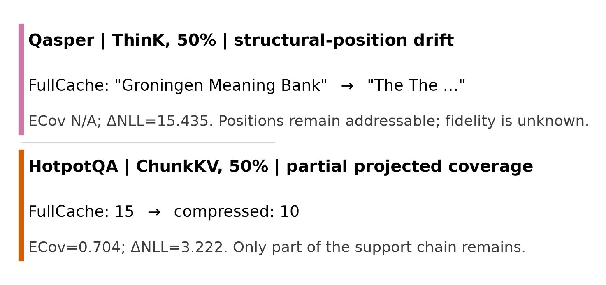

<div align="center">
  
  <h1>KVDiagnosis</h1>
  <p><strong>Diagnosing evidence retention and prediction drift in KV cache compression</strong></p>
  <p>
    <a href="https://github.com/ChosenQC/KVDiagnosis/actions/workflows/ci.yml"></a>
    
    
    
    <a href="LICENSE"></a>
  </p>
</div>

**KVDiagnosis** is a failure-focused benchmark for diagnosing KV cache
compression in long-context language models. It first
evaluates every supported method-ratio cell on the complete source population.
It then selects paired rows where FullCache is correct and compression is wrong
(C->W), and joins cache, logit, attention, and decode-local diagnostics for
those failures.

This repository contains the clean public package aligned with the paper's
final slot-level analysis:

- a complete normalized ledger with 2,600 FullCache controls and 62,400
  method-setting records (59,800 supported and 2,600 explicit N/A);
- 12,520 audited C->W method-ratio rows from RULER-8K, RULER-16K, Qasper,
  and HotpotQA;
- eight valid compression methods at configured 75%, 50%, and 25% KV ratio
  settings;
- per-row layer x KV-head evidence retention, explicit coverage applicability,
  likelihood, attention, and operational failure signatures;
- a 5,970-row RULER-8K context-demand view;
- paper-facing summaries, execution audit, SHA-256 manifest, and release gates;
- a small dependency-free Python package for validation and aggregation.

PyramidKV is excluded because its historical adapter failed the implementation
audit. The tracker replaced PyramidKV's custom compression path with the same
fixed-budget path used for SnapKV, bypassing its layer-dependent budget. A
raw-artifact audit found identical retained mappings, outputs, scores, and gold
NLL in all 7,800 SnapKV/PyramidKV pairs, despite distinct Slurm jobs. The tracker
is corrected in this repository, but the invalid historical rows remain
excluded. See
[`pyramidkv_adapter_audit.json`](data/audits/pyramidkv_adapter_audit.json).
QFilter and Random are not part of the released experimental matrix.

## Diagnostic Protocol

<p align="center">
  
</p>

The population-first workflow records every supported method-setting cell in a
complete paired ledger. Only after that ledger is frozen does each cell select
its own C->W rows for cache, logit, attention, and decode probes. Reporting
keeps own-failure profiles separate from matched-intersection comparisons.

## Main Results

### Population Outcomes

<p align="center">
  
</p>

Stronger compression raises C->W frequency, but the degradation is strongly
method dependent. The 75/50/25 columns order compression severity within each
method; they are not byte-equivalent across mechanisms.

### Failure Identity

<p align="center">
  
</p>

Failure frequency grows on every workload, while low SnapKV-TOVA Jaccard in
most cells shows why each compressor must retain its own failure population.

### Failure Diagnostics

<p align="center">
  
</p>

Low or partial mapped coverage is common. Among rows with measured or projected
token mappings, only 19 combine high evidence coverage with severe gold-answer
likelihood drift. ThinK and QuantizedCache instead expose structural position
addressability: their positions remain addressable, but representation fidelity
is unknown, so numeric ERR/ECov is not reported.

### Evidence-Annotated QA Transfer

<p align="center">
  
</p>

<p align="center">
  
</p>

The category distributions show that the same coverage and likelihood
signatures appear on Qasper and HotpotQA. The paired cases contrast
structural-position likelihood drift with partial projected evidence coverage.
These evidence-mapped bridges support diagnostic transfer, not official QA
ranking or causal labels.

## Quick Start

```bash
python -m venv .venv
. .venv/bin/activate
pip install -e .

kvcachebench validate \
  data/processed/selected_failures/all_selected_failures.jsonl

kvcachebench summarize \
  data/processed/selected_failures/all_selected_failures.jsonl \
  --group-by dataset,method_name,retained_budget \
  --output /tmp/kvbench_summary.csv

python scripts/check_release.py

python scripts/regenerate_paper_artifacts.py \
  --output-dir paper_artifacts/generated
```

Expected selected-failure counts:

| Dataset | Rows |
|---|---:|
| RULER-8K | 5,970 |
| RULER-16K | 5,396 |
| Qasper | 327 |
| HotpotQA | 827 |
| **Total** | **12,520** |

The same source may fail under several method-ratio settings. These are
row-weighted diagnostic counts, not unique-source prevalence.

## Coverage Applicability

The original cross-slot union could report perfect coverage when different
layers or heads retained different evidence fragments. The public artifact uses
`kvbench.slot_ecov.v1` instead:

- `ERR_slot` averages evidence-token retention over 36 layers x 8 KV heads.
- `ECov_slot` is the fraction of layer-KV-head-slot/evidence-span pairs that
  retain at least 50% of a support span.
- `measured_token_coverage` uses retained original-token indices.
- `projected_token_coverage` projects chunk retention back to original-token
  spans and is reported separately from measured coverage.
- `structural_position_addressability` means all token positions remain
  addressable by construction, while representation fidelity is unmeasured.
- `not_applicable` is reserved for runs without a defensible token mapping.

For structural methods, `ERR_slot` and `ECov_slot` are JSON `null`, their
status is `not_applicable`, and
`structural_position_addressability=true`. They are excluded from coverage
means and coverage-based success/failure separation. The released C->W corpus
contains 6,211 measured, 2,224 projected, and 4,085 structural rows.

The 75/50/25 labels are configured KV ratio settings. They are not guaranteed
to represent byte-equivalent memory footprints across token selection, channel
compression, and quantization methods.

## Data Layout

```text
data/
  processed/full_population/
    fullcache.jsonl.gz
    compressed_runs/{ruler8k,ruler16k,qasper,hotpotqa}.jsonl.gz
    summary.json
  processed/selected_failures/
    all_selected_failures.jsonl
    ruler8k.jsonl
    ruler16k.jsonl
    qasper.jsonl
    hotpotqa.jsonl
  context_demand/
    ruler8k_context_demand_dataset.{jsonl,csv}
    summary.json
    validation_report.json
  summaries/
    selected_failures_by_dataset_method_budget.csv
    failure_signatures_by_dataset_method_budget.csv
    failure_signature_totals.json
    slot_ecov_summary.csv
    matched_method_pair_summary.csv
  audits/
    pyramidkv_adapter_audit.json
    slot_ecov_execution_audit.json
  metadata/
    artifact_manifest.json
paper_artifacts/generated/
  run_accounting.json
  full_evaluation_results.csv
  pooled_population_outcomes.csv
  failure_views.csv
  diagnostic_profiles.csv
  qa_signature_counts.csv
  {population-outcomes,failure-views,diagnostic-profiles,qa-transfer,qa-cases}.{pdf,png}
```

## Environment and Provenance

The paper experiments use Qwen3-8B at immutable model revision
`b968826d9c46dd6066d109eabc6255188de91218`, deterministic decoding,
`kvpress==0.5.3` for non-quantized methods, and the Hugging Face cache API for
QuantizedCache. The exact research environment is in
`requirements/requirements_current_experiment.txt`.

The release gate validates all 62,400 planned method-setting keys and confirms
that the ledger's 12,520 C->W keys exactly equal the diagnostic corpus. All 19
accepted diagnostic jobs meet the 75% average utilization gate. See
`docs/reproduction.md` for regeneration commands and `docs/metrics.md` for
metric applicability.
