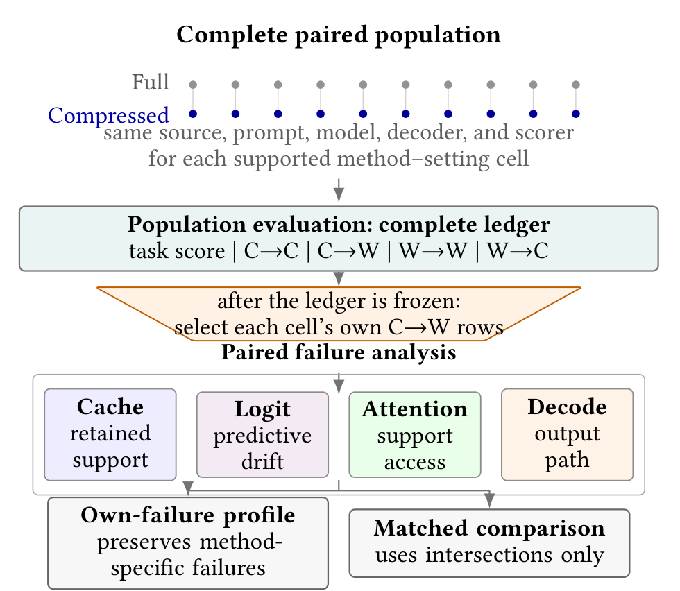
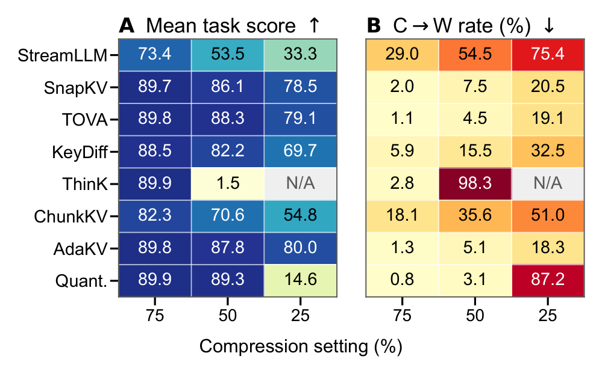
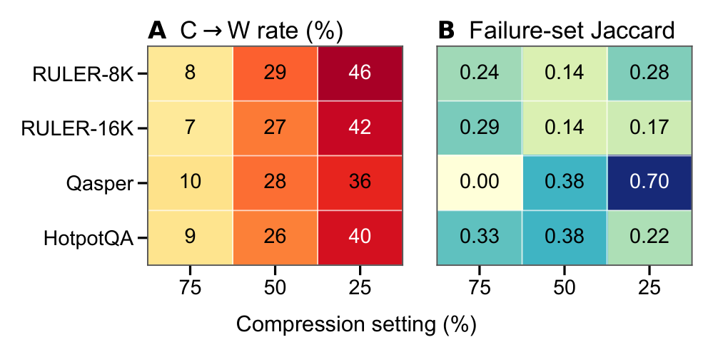
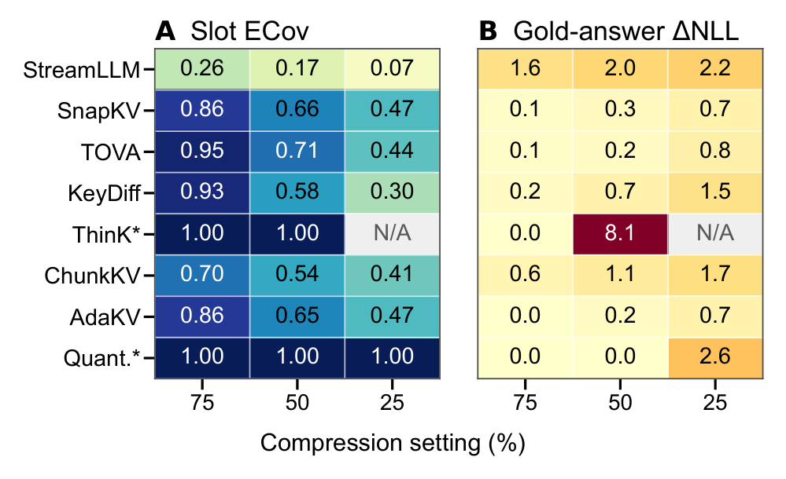
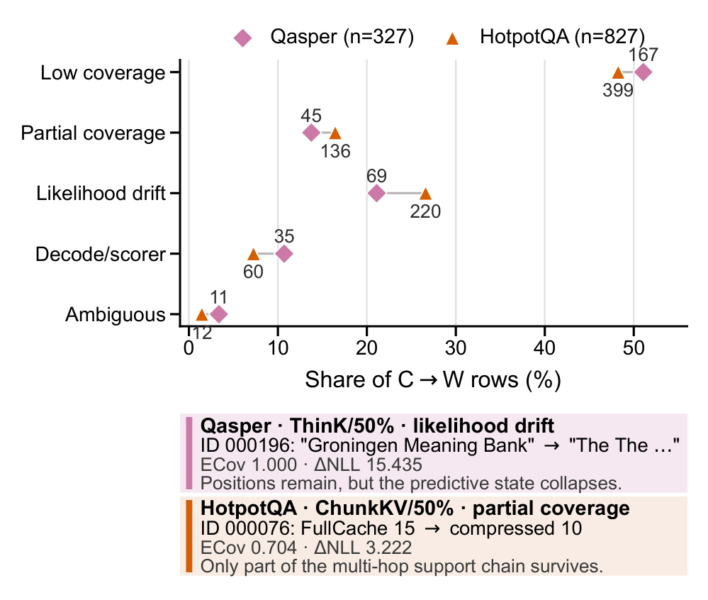

<div align="center">
  
  <h1>KVDiagnosis</h1>
  <p><strong>Diagnosing evidence retention and prediction drift in KV cache compression</strong></p>
  <p>
    <a href="https://github.com/ChosenQC/KVDiagnosis/actions/workflows/ci.yml"></a>
    
    
    <a href="LICENSE"></a>
  </p>
</div>

KVDiagnosis is the public home of **KVCacheBench**, a failure-focused benchmark
for diagnosing KV cache compression in long-context language models. It first
evaluates every supported method-ratio cell on the complete source population.
It then selects paired rows where FullCache is correct and compression is wrong
(C->W), and joins cache, logit, attention, and decode-local diagnostics for
those failures.

This repository contains the clean public package aligned with the paper's
final slot-level analysis:

- 12,520 audited C->W method-ratio rows from RULER-8K, RULER-16K, Qasper,
  and HotpotQA;
- eight valid compression methods at configured 75%, 50%, and 25% KV ratio
  settings;
- per-row layer x KV-head evidence retention, likelihood, attention
  applicability, and operational failure signatures;
- a 5,970-row RULER-8K context-demand view;
- paper-facing summaries, execution audit, SHA-256 manifest, and release gates;
- a small dependency-free Python package for validation and aggregation.

PyramidKV is excluded because its adapter failed the ownership/implementation
audit. QFilter and Random are not part of the released experimental matrix.

## Diagnostic Protocol

<p align="center">
  
</p>

The population-first workflow records every supported method-setting cell in a
complete paired ledger. Only after that ledger is frozen does each cell select
its own C->W rows for cache, logit, attention, and decode probes. Reporting
keeps own-failure profiles separate from matched-intersection comparisons.

## Main Results

### Population Outcomes

<p align="center">
  
</p>

Stronger compression raises C->W frequency, but the degradation is strongly
method dependent. The 75/50/25 columns order compression severity within each
method; they are not byte-equivalent across mechanisms.

### Failure Identity

<p align="center">
  
</p>

Failure frequency grows on every workload, while low SnapKV-TOVA Jaccard in
most cells shows why each compressor must retain its own failure population.

### Failure Diagnostics

<p align="center">
  
</p>

Low or partial slot coverage is common, but high position coverage can coexist
with severe gold-answer likelihood drift. Stars mark ThinK and QuantizedCache,
whose token positions are structurally preserved rather than selected.

### Evidence-Annotated QA Transfer

<p align="center">
  
</p>

The same coverage and likelihood signatures appear on Qasper and HotpotQA.
These evidence-mapped bridges support diagnostic transfer, not official QA
ranking.

## Quick Start

```bash
python -m venv .venv
. .venv/bin/activate
pip install -e .

kvcachebench validate \
  data/processed/selected_failures/all_selected_failures.jsonl

kvcachebench summarize \
  data/processed/selected_failures/all_selected_failures.jsonl \
  --group-by dataset,method_name,retained_budget \
  --output /tmp/kvbench_summary.csv

python scripts/check_release.py
```

Expected selected-failure counts:

| Dataset | Rows |
|---|---:|
| RULER-8K | 5,970 |
| RULER-16K | 5,396 |
| Qasper | 327 |
| HotpotQA | 827 |
| **Total** | **12,520** |

The same source may fail under several method-ratio settings. These are
row-weighted diagnostic counts, not unique-source prevalence.

## Corrected Evidence Coverage

The original cross-slot union could report perfect coverage when different
layers or heads retained different evidence fragments. The public artifact uses
`kvbench.slot_ecov.v1` instead:

- `ERR_slot` averages evidence-token retention over 36 layers x 8 KV heads.
- `ECov_slot` is the fraction of layer-KV-head-slot/evidence-span pairs that
  retain at least 50% of a support span.
- `retention_semantics` distinguishes measured position selection from
  structural position preservation.

ThinK and QuantizedCache preserve token positions structurally, so their
`ECov_slot` can equal one while key channels, values, likelihoods, or outputs
are damaged. Their coverage values are not selector-quality measurements.

The 75/50/25 labels are configured KV ratio settings. They are not guaranteed
to represent byte-equivalent memory footprints across token selection, channel
compression, and quantization methods.

## Data Layout

```text
data/
  processed/selected_failures/
    all_selected_failures.jsonl
    ruler8k.jsonl
    ruler16k.jsonl
    qasper.jsonl
    hotpotqa.jsonl
  context_demand/
    ruler8k_context_demand_dataset.{jsonl,csv}
    summary.json
    validation_report.json
  summaries/
    selected_failures_by_dataset_method_budget.csv
    failure_signatures_by_dataset_method_budget.csv
    failure_signature_totals.json
    slot_ecov_summary.csv
    matched_method_pair_summary.csv
  audits/
    slot_ecov_execution_audit.json
  metadata/
    artifact_manifest.json
```

Full benchmark prompts, checkpoints, per-unit retained-position maps, Slurm
logs, and private caches are intentionally excluded. Prompt construction is
reproducible from the upstream RULER, Qasper, and HotpotQA sources.

## Environment and Provenance

The paper experiments use Qwen3-8B at immutable model revision
`b968826d9c46dd6066d109eabc6255188de91218`, deterministic decoding,
`kvpress==0.5.3` for non-quantized methods, and the Hugging Face cache API for
QuantizedCache. The exact research environment is in
`requirements/requirements_current_experiment.txt`.

The execution audit validates all 12,520 expected keys with zero missing,
unexpected, or failed rows. All 19 accepted GPU jobs meet the 75% average
utilization gate. See `docs/reproduction.md` for regeneration commands and
`docs/metrics.md` for metric applicability.
